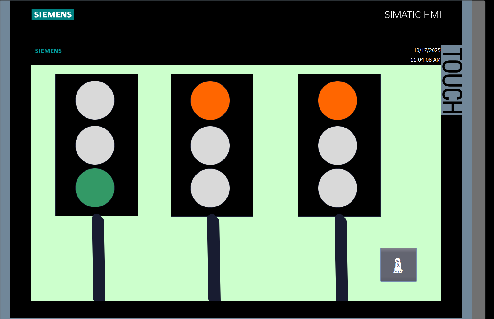
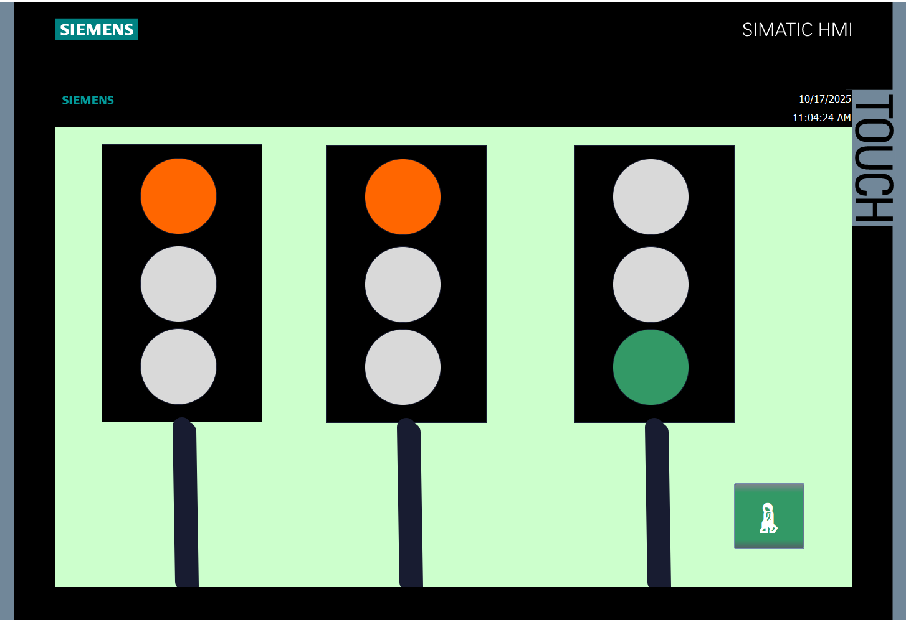
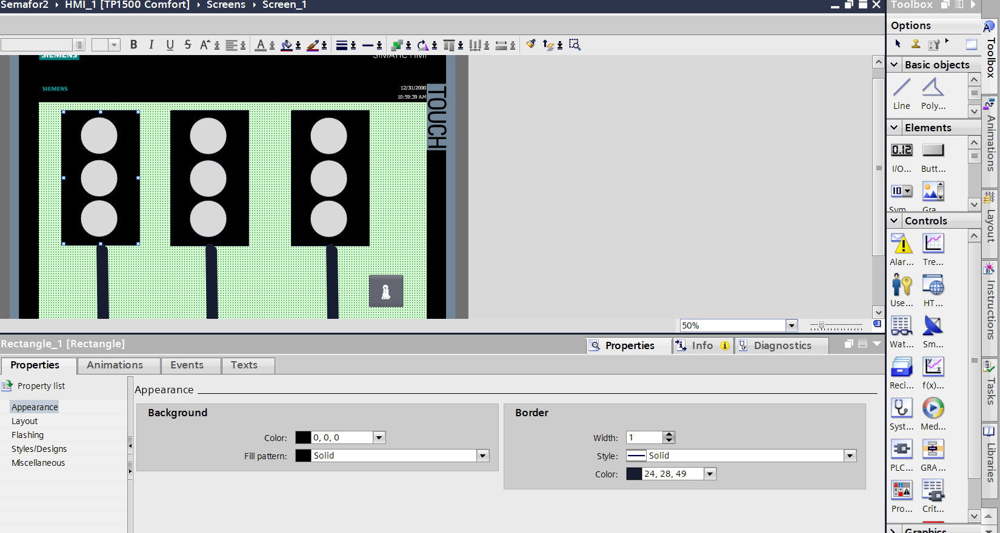
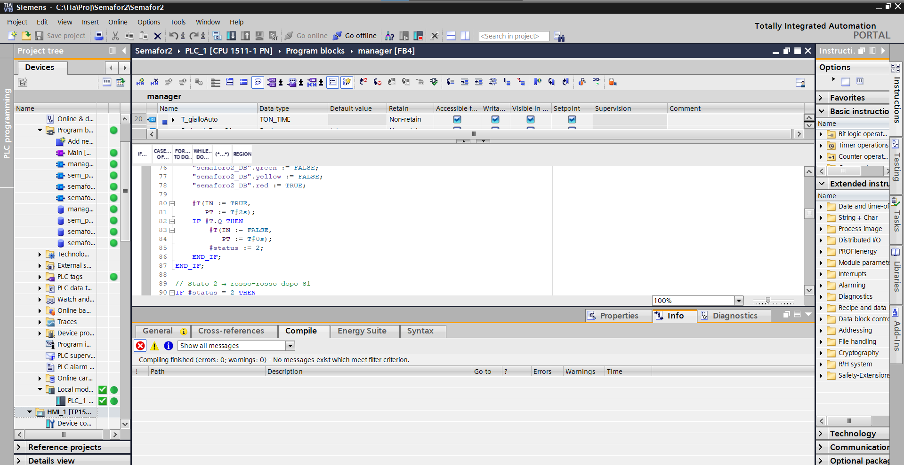
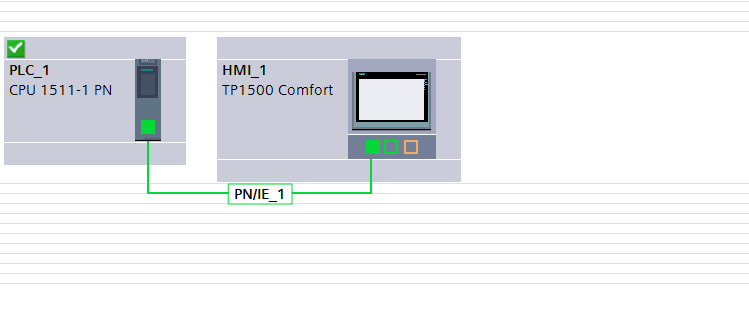

# 🚦 Semaforo PLC con gestione pedonale

> Progetto realizzato durante il periodo di **FSL** in ambito **automazione industriale**, sviluppato con **Siemens TIA Portal**, **PLC S7-1500**, **HMI TP1500 Comfort** e programmazione in **PLC**.

---

## 📌 Descrizione del progetto

Questo progetto simula il funzionamento di un **impianto semaforico intelligente** composto da:

- due semafori veicolari
- un attraversamento pedonale
- un pulsante di chiamata pedonale
- una schermata **HMI** per il monitoraggio e l’interazione

L’obiettivo principale è stato realizzare una logica di controllo **ordinata, sicura e realistica**, capace di:

- gestire il traffico veicolare nelle due direzioni
- evitare conflitti tra i segnali
- gestire correttamente la richiesta pedonale
- visualizzare lo stato del sistema tramite interfaccia grafica

Il cuore del progetto è una **macchina a stati** sviluppata in **linguaggio PLC**, che permette di controllare in modo chiaro tutte le fasi del ciclo semaforico.

---

## 🎯 Obiettivi del progetto

- ✅ Simulare un incrocio con due direzioni di traffico
- ✅ Gestire un attraversamento pedonale su richiesta
- ✅ Garantire la sicurezza del ciclo semaforico
- ✅ Utilizzare timer e logica sequenziale PLC
- ✅ Creare una visualizzazione HMI intuitiva
- ✅ Documentare il funzionamento del codice

---

## 🛠️ Tecnologie utilizzate

- **Siemens TIA Portal**
- **PLC Siemens S7-1500**
- **HMI Siemens TP1500 Comfort**
- **Linguaggio SCL**
- **Logica a stati**
- **Timer TON**

---

## 🧠 Logica generale del sistema

Il sistema è strutturato come una **sequenza di stati**.

Ogni stato rappresenta una fase precisa del semaforo:

- **Stato 0** → Semaforo 1 verde, Semaforo 2 rosso
- **Stato 1** → Semaforo 1 giallo, Semaforo 2 rosso
- **Stato 2** → Rosso-rosso di sicurezza
- **Stato 3** → Semaforo 1 rosso, Semaforo 2 verde
- **Stato 4** → Semaforo 1 rosso, Semaforo 2 giallo
- **Stato 5** → Rosso-rosso di sicurezza
- **Stato 7** → Pedonale verde
- **Stato 8** → Pedonale giallo
- **Stato 9** → Attesa finale e ripartenza del ciclo

Questa struttura rende il codice ordinato, leggibile e facilmente modificabile.

---

## 🖼️ Screenshot del progetto

---

## 🎥 Video dimostrativo

Nel video seguente viene mostrato il funzionamento del progetto, con la simulazione del ciclo semaforico e della chiamata pedonale:

🔗 **[Guarda il video del progetto]([https://youtu.be/aAqy0ik9YIc)**

---

│   └── presentazione.pdf
└── video/
    └── link-video.txt
